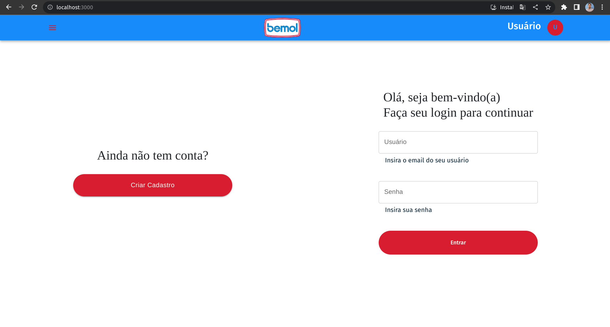
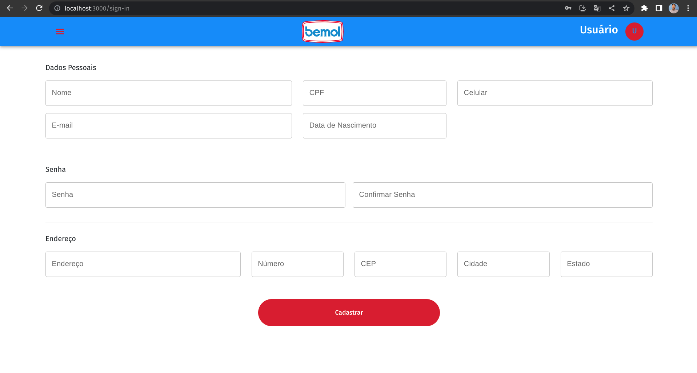
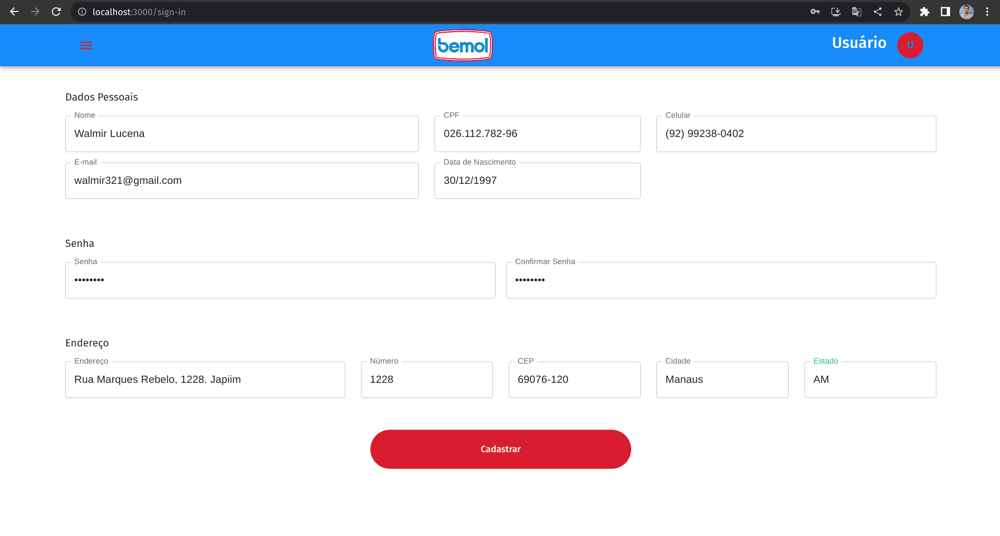
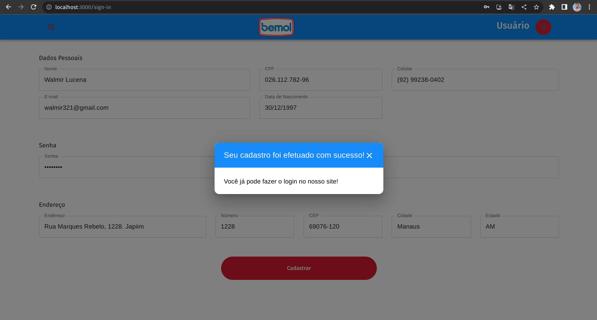

# Bemol OnBoarding Frontend

- Este projeto consiste num Frontend para cadastro de usuários, listagem de usuários e atualização destes dados. Utiliza de React com Material UI para o desenvolvimento de componentes e telas.

# 🧰 Technologies

- Frontend
  - React
  - TypeScript
  - MaterialUI
  - ReactHookForm
  - Axios

# 🚀 Como Usar

### 💾 Clone o Repositório

```
- git clone
```

## Executando o projeto

É necessário que você tenha o yarn ou npm na sua máquina. Após a intalação destes rode o seguinte comando

- Subindo com yarn

  ```
   - yarn first-install
  ```

  - Subindo com npm

  ```
   - npm install
  ```

  📋 Verifique a Aplicação Web em http://localhost:3000

# Possíveis melhorias

- Instalar o Eslint no Projeto
- Fazer Testes com o Jest
- Componentizar Input
- Adicionar estrutura de pastas Domain, Data, Infra para aumentar a confiabilidade do código
- Adicionar o Context ou Redux para o controle de estado global após login
- Adicionar Rota de Login
- Adicionar Página para a Edição dos dados cadastrados
- Listar os dados de um usuário após Login

# Imagens do Projeto





